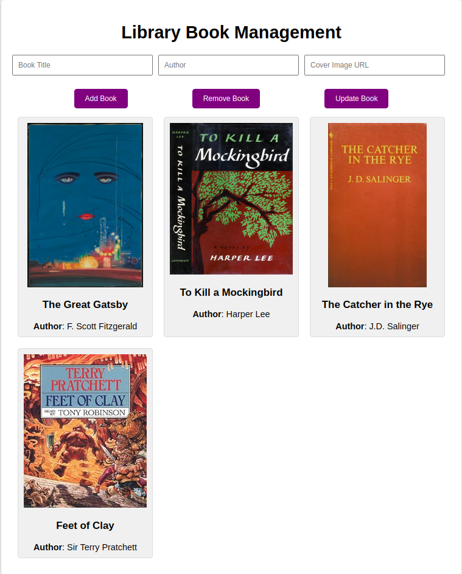

## Website Instructions

Here's how to use the website:

1. Open it in your favorite browser.
2. Feel like adding a new book? Just tap "Add Book" and fill in the info.
3. Want to tweak a book's details? Hit "Update" next to the book and punch in the new title, author, and cover image URL.
4. Time to bid a book farewell? Click "Remove" next to it, type the title, and poof, it's gone.
5. Organize your library by title or author by picking your choice from the "Sort By" menu.

## Tech Magic Inside

Now, here's the techy stuff:

* Classes: I whipped up a cool Book class. It's like a blueprint for books with slots for title, author, and cover image URL. Keeps everything neat.

* Switch Statements: Ever heard of sorting? We use switch statements for that. They're like magic buttons for organizing the library. Just pick your criteria, and it's done.

* Try-Catch-Finally Statements: Things don't always go as planned. In case stuff messes up, we've got these try-catch-finally things. For example, when we're saving library data, we try to do it. If anything goes wrong, we catch the problem. Finally, we make sure everything gets sorted.

With all this cool stuff, the website runs smoothly, keeps your books in check, and handles hiccups like a pro. Enjoy! 📚🚀

### Site Example

